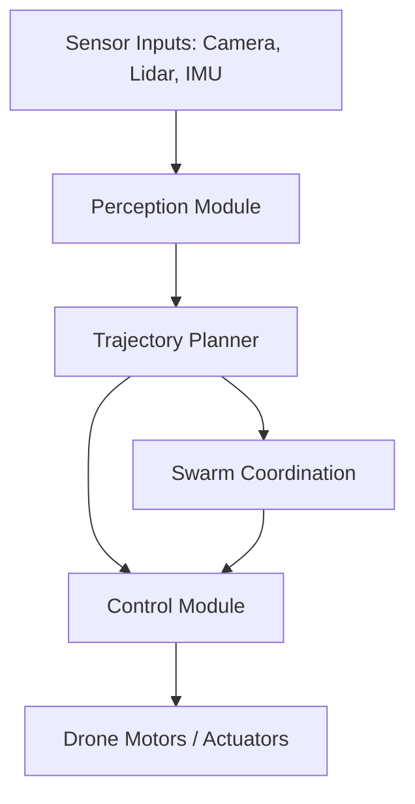

# Architecture Diagram

```mermaid
flowchart TD
    A[Sensor Inputs: Camera, Lidar, IMU] --> B[Perception Module]
    B --> C[Trajectory Planner]
    C --> D[Control Module]
    D --> E[Drone Motors / Actuators]
    C --> F[Swarm Coordination]
    F --> D
```
